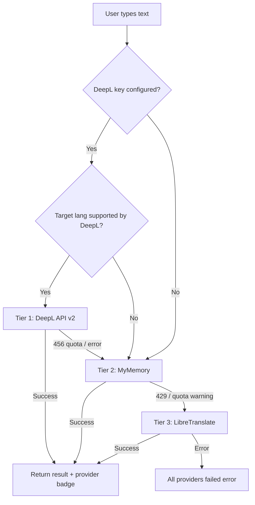

# LinguaFlow AI — 3-Tier Translation Provider Upgrade

## Status: Code Complete ✅ | Build Passing ✅ | Ready for Deployment

---

## What Was Done (by Claude Code in the terminal)

Claude Code completed **all code changes** across 11 files. The build compiles cleanly with zero TypeScript errors.

### Changes Summary

| File | What Changed |
|------|-------------|
| [index.ts](file:///home/sauravkumar/HorizonTechX_Language-Translation-Tool/src/types/index.ts) | Added `deeplCode?` to `Language`, new `TranslationProvider` union type, `TranslationErrorType`, added `provider` + `errorType` to `TranslationState` |
| [constants.ts](file:///home/sauravkumar/HorizonTechX_Language-Translation-Tool/src/lib/constants.ts) | Added DeepL endpoints, `PROVIDER_LABELS`, `FALLBACK_PROVIDERS`, `TRANSLATION_TIMEOUT_MS`, `RATE_LIMIT` config |
| [languages.ts](file:///home/sauravkumar/HorizonTechX_Language-Translation-Tool/src/lib/languages.ts) | Added `deeplCode` to 16 DeepL-supported languages, new `getDeeplCode()` helper |
| [translationService.ts](file:///home/sauravkumar/HorizonTechX_Language-Translation-Tool/src/lib/translationService.ts) | **Complete rewrite** — 3-tier waterfall: DeepL → MyMemory → LibreTranslate, with `fetchWithTimeout`, DeepL native `formality` for tone, upgraded `detectLanguage` |
| [route.ts (translate)](file:///home/sauravkumar/HorizonTechX_Language-Translation-Tool/src/app/api/translate/route.ts) | Added in-memory rate limiting (30 req/min/IP), passes `tone` to service, returns `provider` in response |
| [route.ts (detect)](file:///home/sauravkumar/HorizonTechX_Language-Translation-Tool/src/app/api/detect/route.ts) | Now uses upgraded `detectLanguage` (DeepL primary → MyMemory fallback) |
| [useTranslation.ts](file:///home/sauravkumar/HorizonTechX_Language-Translation-Tool/src/hooks/useTranslation.ts) | Tracks `provider` + `errorType` state, differentiated error handling (429→quota, 400→invalid, network errors) |
| [TextOutputArea.tsx](file:///home/sauravkumar/HorizonTechX_Language-Translation-Tool/src/components/translation/TextOutputArea.tsx) | Shows provider badge ("Translated by DeepL ✓"), fallback hint when premium unavailable |
| [TranslatorCard.tsx](file:///home/sauravkumar/HorizonTechX_Language-Translation-Tool/src/components/translation/TranslatorCard.tsx) | Passes `provider` from state to `TextOutputArea` |
| [.env.example](file:///home/sauravkumar/HorizonTechX_Language-Translation-Tool/.env.example) | Updated with all 4 new env vars and documentation |

### Architecture: 3-Tier Provider Waterfall



### Tone Handling (DeepL Native Formality)

Instead of post-processing text with canned templates, the upgrade uses DeepL's native `formality` parameter:

| App Tone | DeepL Formality | Behavior |
|----------|----------------|----------|
| `formal` / `professional` | `prefer_more` | Formal register (Sie/vous) |
| `casual` / `friendly` | `prefer_less` | Informal register (du/tu) |
| `default` | _(omitted)_ | Natural default |

> The `prefer_*` variants gracefully no-op for languages that don't support formality (e.g., Hindi, Chinese).

---

## Build Verification ✅

```
▲ Next.js 16.2.6 (Turbopack)
✓ Compiled successfully in 4.1s
✓ TypeScript — 0 errors
✓ Static pages generated (5/5)

Routes:
  ○ /              (Static)
  ƒ /api/detect    (Dynamic)
  ƒ /api/translate (Dynamic)
```

---

## What's Left — Deployment Steps

### Step 1: Create `.env.local` for Local Testing

```bash
cp .env.example .env.local
```

Then edit `.env.local` with your actual keys:

```env
DEEPL_API_KEY=your-actual-deepl-key        # Get free at https://www.deepl.com/pro-api
MYMEMORY_EMAIL=your@email.com              # Raises MyMemory quota
LIBRE_TRANSLATE_URL=https://libretranslate.com
LIBRE_TRANSLATE_API_KEY=
```

### Step 2: Add Environment Variables in Vercel

Go to **Vercel Dashboard → Your Project → Settings → Environment Variables** and add:

| Variable | Value | Required? |
|----------|-------|-----------|
| `DEEPL_API_KEY` | Your DeepL API key | **Yes** (for premium quality) |
| `MYMEMORY_EMAIL` | `your@email.com` | Recommended |
| `LIBRE_TRANSLATE_URL` | `https://libretranslate.com` | No |
| `LIBRE_TRANSLATE_API_KEY` | _(leave blank)_ | No |

> [!WARNING]
> Do NOT use `NEXT_PUBLIC_` prefix on `DEEPL_API_KEY` — it must stay server-side only.

### Step 3: Commit & Deploy

```bash
git add -A
git commit -m "feat: upgrade to 3-tier translation (DeepL → MyMemory → LibreTranslate)"
git push
```

Or trigger a redeploy manually from the Vercel dashboard.

### Step 4: Verify

1. **Test DeepL**: Translate any text → look for "Translated by DeepL ✓" badge
2. **Check logs**: Vercel Dashboard → Logs → filter "Functions" → look for `[Translation] Using provider: deepl`
3. **Test fallback**: Temporarily set `DEEPL_API_KEY` to `invalid_key`, redeploy, verify MyMemory fallback works

---

## Free Tier Limits

| Provider | Monthly Limit | Quality |
|----------|--------------|---------|
| DeepL | 500,000 chars | ⭐⭐⭐⭐⭐ |
| MyMemory (with email) | ~300,000 chars | ⭐⭐⭐ |
| LibreTranslate (public) | Rate-limited | ⭐⭐ |
